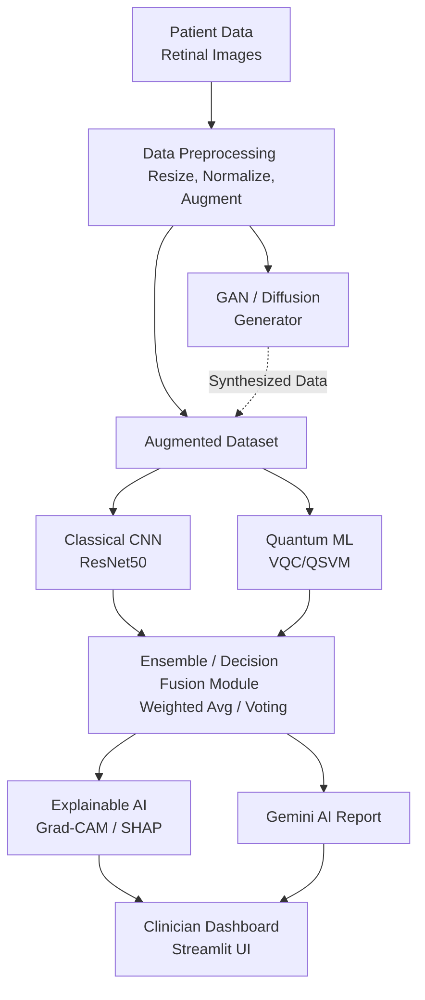

# dAIgnoQ: Quantum-AI Medical Diagnosis Platform

dAIgnoQ is a generalized **Quantum-Classical Hybrid AI Platform designed specifically for diagnosing rare diseases**.

Because rare disease datasets are notoriously small, dAIgnoQ provides an end-to-end pipeline:
1. **Upload any small dataset** (auto-detected folders or CSV).
2. **Generate synthetic data** using built-in GAN or DDPM Diffusion models to augmentation your dataset.
3. **Train powerful models directly in the app**, including Classical CNNs (ResNet50) and Quantum Machine Learning models (Quantum SVM pipelines).
4. **Test and diagnose** new images using single models or Ensemble Decision Fusion.
5. **Review transparent diagnostics** through visual Explainable AI (Grad-CAM, SHAP) and text-based Gemini AI diagnostic reports.

## 🏗️ Architecture



## 🚀 Key Features

- **Hybrid Classification:** Combines classical CNNs (ResNet50) with Variational Quantum Circuits (VQC) and Quantum Support Vector Machines (QSVM) for enhanced diagnostic accuracy.
- **Ensemble Decision Fusion:** Meta-classifier fusing classical + quantum outputs using weighted average, max confidence, or majority voting strategies.
- **Synthetic Data Generation:** GANs and DDPM Diffusion Models to create synthetic medical images for research and training.
- **Generalized Dataset Preparation:** Dataset path-based loader with auto-detection for `positive/negative` folders, `images + labels.csv`, or single-folder mode.
- **Intelligent Strategy Selection:** Data-driven recommendation engine auto-suggests GAN vs Diffusion and whether augmentation should be applied.
- **Trainable Generators:** Optional in-app GAN/Diffusion training on uploaded datasets before sampling synthetic images.
- **In-App Model Training:** Train classical (ResNet50) and quantum (QSVM pipeline) models from prepared data splits.
- **Explainable AI:** Grad-CAM heatmaps, SHAP feature attribution, and Gemini AI-generated analysis reports.
- **Clinician Dashboard:** Interactive Streamlit UI with risk indicators, confidence bars, and side-by-side XAI visualizations.

## 🛠️ Installation

Ensure you have Python 3.8+ installed. Clone the repository and install dependencies:

```bash
pip install -r requirements.txt
```

## ⚙️ Setup

To enable the AI-powered analysis report, configure your Google Gemini API key:

1. Obtain an API key from [Google AI Studio](https://aistudio.google.com/).
2. Enter the key in the application's sidebar under "Gemini AI".

## 🖥️ Usage

```bash
# Option 1: Streamlit (Recommended)
streamlit run dAIgnoQ/app/main.py

# Option 2: Python launcher
python dAIgnoQ/run_app.py
```

## 📁 Project Structure

```
dAIgnoQ/
├── app/
│   ├── main.py                  # Streamlit application (6 tabs: prep, training, classify, ensemble, generation, XAI review)
│   ├── config.py                # Paths, parameters, labels
│   ├── components/
│   │   ├── sidebar.py           # Sidebar configuration panel
│   │   └── dataset_uploader.py  # Dataset validation, loading, and splitting UI
│   └── utils/
│       ├── data_manager.py      # Dataset format detection, loading, splitting
│       ├── data_intelligence.py # Auto strategy recommendation (GAN/Diffusion + augmentation)
│       ├── augmentation.py      # Optional train-split augmentation pipeline
│       ├── classifier.py        # MedicalImageClassifier class
│       ├── ensemble.py          # EnsembleClassifier (decision fusion)
│       ├── architectures.py     # HybridModel, Generator, Discriminator, DiffusionUNet
│       ├── generation_utils.py  # GAN + Diffusion image generation
│       ├── generative_trainer.py# GAN/Diffusion training on user datasets
│       ├── training_pipeline.py # Classical ResNet50 + quantum QSVM training pipeline
│       ├── training_db.py       # SQLite tracking for training/generation runs
│       ├── quantum_utils.py     # VQC circuits, QSVM kernels
│       └── xai_utils.py         # Grad-CAM, SHAP, Gemini explanations
├── data/
│   ├── G1020/                   # Glaucoma dataset (train/test split)
│   └── Gan_Train_Dataset/       # GAN training data
├── models/
│   └── checkpoints/             # Trained model weights
├── notebooks/
│   ├── training/                # CNN, VQC, QSVM training notebooks
│   └── generation/              # GAN, Diffusion training notebooks
├── requirements.txt
├── run_app.py
└── README.md
```

## 🧠 Model Information

| Model | Type | Description |
|-------|------|-------------|
| ResNet50 | Classical CNN | Pre-trained feature extractor, interactively fine-tuned on user-supplied datasets |
| QSVM | Quantum SVM | Quantum kernel-based SVM built via PennyLane, trained on user data in-app |
| CNN+VQC | Hybrid | ResNet18 backbone alongside a Variational Quantum Circuit |
| GAN | Generative | User-trained to synthesize images simulating the uploaded rare disease |
| Diffusion | Generative | DDPM-based reverse-diffusion model, user-trained for high-fidelity data augmentation |

---

*Team Overfit Squad — Ayush Chintalwar, Tanishq Zade, Advait Raktate, Divyansh Dubey*
